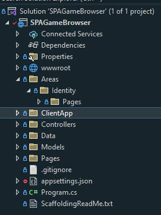
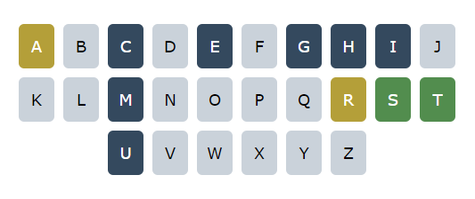


<h1 align="center">SPA Wordle Game 🧩🧩🎮 </h1>

<p align = center>
by <a href="https://github.com/Cecilia-Coutinho">Cecilia Coutinho</a>
</p>

## 🌍 Overview

The development of this project was required by Chas Academy, and as such, it followed the specified requirements and deadline. 

The application is a web-based word-guessing game featuring user authentication, gameplay, user profiles, and highscores. It operates as a Single Page Application (SPA) with server-side game logic computation. React.js is used for the frontend, while the backend is built using an ASP.NET Core API with controllers.

## 🚀 Features

✅ User authentication with Identity.

✅ Intuitive navigation.

✅ Interactive gameplay.

✅ Highscores tracking.

✅ Single Page Application (SPA) design.

✅ Game logic on the server.

✅ User-friendly interface built with React.js.

✅ ASP.NET Core API backend.


## 💻 Technology Stack

* ASP.NET Core

* C#

* SQL Server Management Studio (SSMS)

* Entity Framework

* React.js 

* HTML

* CSS

* JavaScript

* Visual Studio

* GitHub


## 📋 Additional Information

### SQL Design

The SQL design follows a relational database model, with tables representing entities such as Users, Words, and UserScores to manage user authentication, word selection, and game statistics. Relationships are established using foreign keys to maintain data integrity.


### Code Structure

This project is set up to work as a Single Page Application (SPA) using ASP.NET Core on the server side and React on the client side. The server side handles tasks like managing user accounts and handling requests from the client. The client side is responsible for creating the interactive and dynamic user interface. The structure keeps the code organized and makes it easier to work on different parts of the project.





### Server-Side Logic

The server-side logic is organized into three main controllers: Letters, UserScore, and Words. 

The Letters controller manages letter retrieval for the keypad displayed in the game and utilizes caching to improve performance. 

On the client side, it's responsible for the functionality of the colors displayed in the game keypad.




The UserScore controller handles user game statistics, including total games played, games won, winning percentage, and average guesses per game. 

```
    var result = new ScoreViewModel
    {
        Name = user?.Nickname,
        TotalGamesPlayed = totalGamesPlayed,
        TotalGamesWon = totalGamesWon,
        WinningPercentage = winningPercentage,
        AverageGuessesPerGame = averageGuessesPerGame
    };
```

Additionally, it provides endpoints for user statistics, daily highscores, and historical highscores for the leaderboard. 

```
// GET: api/UserScore
[HttpGet]
[Authorize]
public async Task<ActionResult<UserScore>> GetUserStatistics()
{
   ...
}

// GET: api/DailyHighscores
[HttpGet("Daily")]
public async Task<ActionResult<IEnumerable<UserScore>>> DailyHighscores()
{
   ...
}

// GET: api/UserScore
[HttpGet("History")]
public async Task<ActionResult<IEnumerable<UserScore>>> GetHistoricalHighscores()
{
   ...
}

// POST: api/UserScore
[HttpPost]
[Authorize]
public async Task<ActionResult<UserScore>> PostUserScore(UserScore userScore)
{
   ...
}
```


The Words controller is responsible for retrieving words for the game and with also utilizes caching to enhance performance.

The decision of implementing caching in both the Letters and Words controllers was made to reduce database resquest queries.


```
public async Task<ActionResult<IEnumerable<Word>>> GetWords()
{
   ...

    words = await _context.Words.ToListAsync();

    var cacheEntryOptions = new MemoryCacheEntryOptions()
        .SetSlidingExpiration(TimeSpan.FromDays(1))
        .SetAbsoluteExpiration(TimeSpan.FromDays(7))
        .SetPriority(CacheItemPriority.Normal);

    _cache.Set(cacheKey, words, cacheEntryOptions);

  ...

    return Ok(words);
}
```

The randon logic was applied in the client-side, but I believe it could to enhance data integrity if I had implemented it on the server side. That's something I need to take into consideration for future projects right from the beginning, ensuring that time constraints don't compromise the implementation.

I've also used localStorage for user state persistence in the game, so if the players come back to the page, the game will appear as it did the last time they played, with the exception of clearing the browser's cache.

```
const fetchSolution = async () => { 
    if (getWord && getWord.length > 0) {
        const randomSolution = getWord[Math.floor(Math.random() * getWord.length)];
        const storedSolution = localStorage.getItem('wordleSolution');
        const storedSolutionId = localStorage.getItem('wordleSolutionId');

        if (storedSolution) {
            setSolution(storedSolution);
            setSolutionId(storedSolutionId);
        } else {
            setSolution(randomSolution.wordName);
            setSolutionId(randomSolution.wordId);
            localStorage.setItem('wordleSolution', randomSolution.wordName);
            localStorage.setItem('wordleSolutionId', randomSolution.wordId);

            const startedAt = (new Date()).toISOString().slice(0, 19).replace(/-/g, "/").replace("T", " ");
            localStorage.setItem('startedAt', startedAt)
        }
    }
```

#### Seed Data

Seed Data was implemented to provide a set of information that is automatically inserted into the database during application initialization or migration. This ensures a starting point for testing and application functionality. The implementation utilizes Entity Framework Core's ModelBuilder to seed data into two entities: Word and Letter. The Seed method, an extension of ModelBuilder, populates the database with an array of predefined Word and Letter objects.

```
public static class ModelBuilderExtensions
{
    public static void Seed (this ModelBuilder modelBuilder)
    {
        //Words:
        modelBuilder.Entity<Word>().HasData(new[]
        {
            new Word { WordId = 1, WordName = "apple" },
            ...

        });

        //Letters:
        modelBuilder.Entity<Letter>().HasData(new[]
        {
            new Letter { LetterId = 1, Key = 'a' },
            ...

        });
    }
}
```

### Conclusion
In summary, the implementation showcases user authentication, intuitive navigation, interactive gameplay, highscores tracking, and a Single Page Application (SPA) design. 

In a production environment, certain configurations need to be adjusted for security and performance reasons, such as strengthening password policies, enabling account confirmation, and implementing other security measures. It's essential to secure the random solution for the word directly from the server side and enhance the words dictionary seeded in the database. Additionally, quality assurance (QA) processes should be conducted.

Eg:

```
builder.Services.AddDefaultIdentity<ApplicationUser>(
    options => 
    { 
        options.SignIn.RequireConfirmedAccount = false;
        options.Password.RequireNonAlphanumeric = false;
        options.Password.RequireLowercase = false;
        options.Password.RequireUppercase = false;
    })
```

Optimizing database performance and deploying the application on secure servers are also essential steps. This could involve leveraging cloud services, for instance. 

